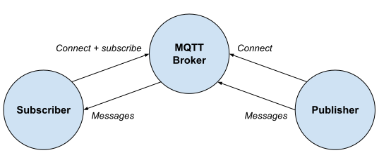

# Simple workflow

- In a container the following components are executed
  - A MQTT message broker
  - The script [publisher.py](publisher.py) connects to the broker and generates regular messages
- On a different server the script [subscriber.py](subscriber.py) is used to connect to the broker and subscribe to the messages

