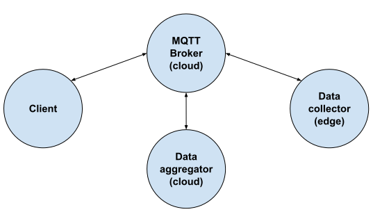

# Advanced workflow

- In a container running on an edge node the following component is executed
  - The script [collector-edge.py](collector-edge.py) performs the following operations
    - Connect to the MQTT broker
    - Regularly collect local data (currently the load of the edge server)
    - After each measurement, publish it via the broker
- In a container running on a cloud node the following components are executed
  - A MQTT message broker
  - The script [aggregator-cloud.py](aggregator-cloud.py) performs the following operations
    - Connect to the MQTT broker
    - Wait for incoming measurements and aggregate these
    - In case sufficient data has been received (currently controlled by a timer) publish aggregated measurement results
- On a different server the script [client.py](client.py) is used to connect to the broker and subscribe to the messages from the aggregator

