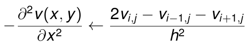
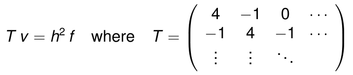
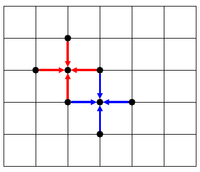
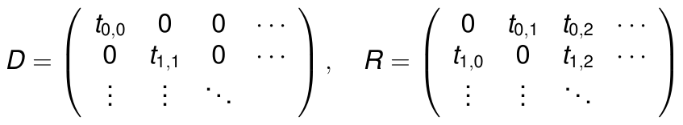
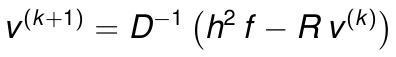

# HAICGU Training: Poisson Equation Solving

## Introduction

The goal of this lab is to familiarise with the concepts of performance engineering. For this purpose, a simple but non-trivial numerical problem is considered, namely solving the Poisson equation in 2 dimensions using the iterative Jacobi algorithm.

The following implementations of the numerical problem are provided:

- C programmers: [c/main.c](c/main.c), [c/solver.c](c/solver.c)
- Fortran programmers: [f90/main.f90](f90/main.f90), [f90/solver.f90](f90/solver.f90)

The next section provides background on the problem, which is considered during this lab. Thereafter, a set of tasks and questions are given that need to be addressed for completing this lab. We will ask you to use the performance analysis tool Scalasca.

## Poisson equation

In 2 dimensions the Poisson equation is defined as follows:

To use this equation in a computer requires it to be discretised. The second-order derivatives can be discretised as follows:

This allows us to write the discretised version of the original equation in a rather compact form:

The following figure shows a graphical representation of the matrix-vector product *T v*:

The following observations are important:

- The matrix *T* is very sparse and diagonally dominant.
- The matrix-vector multiplication *T v* becomes a stencil operation where each element of *v* is re-used exactly 4 times.

To solve the Poisson equation, one can use the Jacobi algorithm, which is suitable for diagonally dominant systems. For this purpose, we decompose *T = D + R*, where *D* contains all the diagonal elements and *R* the remaining off-diagonal elements:

The Jacobi algorithm provides us with an iterative procedure for obtaining the solution vector *v*:

The iterative procedure is continued until the relative change from *v(k)* to *v(k+1)* has become sufficiently small.

## Tasks and questions

For this hands-on session, consider the following questions and address the following tasks:

1) Identify the performance critical code region.
2) Compute the arithmetic intensity (ignoring caches) for this code region and argue whether you expect it to be compute performance or memory bandwidth bound.
3) Compute the expected execution time per solver iteration as a function of *NX*, *NY*, arithmetic intensity and the hardware parameter identified as relevant with the previous question, i.e. throughput of floating-point operations or memory bandwidth.
4) For the performance critical code region, identify spatial and temporal data locality properties of the relevant data objects.
5) Based on the data locality properties argue why the choice of the loop order is bad.
6) Provide empirical evidence for your arguments by measuring time as well as the L1 data cache misses using Scalasca (via the PAPI counter ``PAPI_L1_DCM``) for (*NX*,*NY*)=(16,1024).
7) After having optimised the code, what will run faster: (*NX*,*NY*)=(16,1024) or (*NX*,*NY*)=(1024,16)? Proof this by measuring time and L1 data cache misses and argue, why this meets your expectations based on data locality arguments.
8) Compute the effective bandwidth, which is defined as the ratio of amount of loaded plus stored data (ignoring data locality) divided by the execution time. How does this compare to the hardware parameters of the node, which you have been using?
